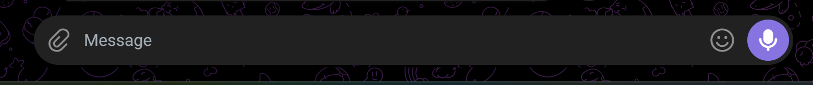
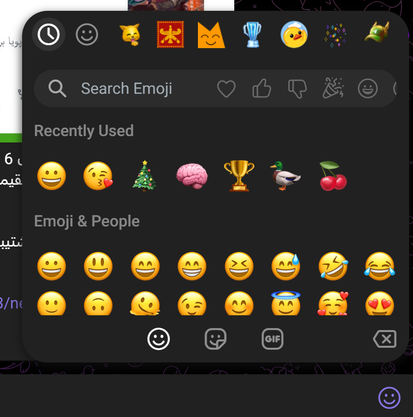
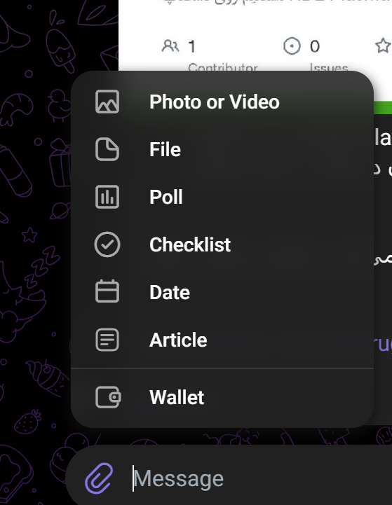
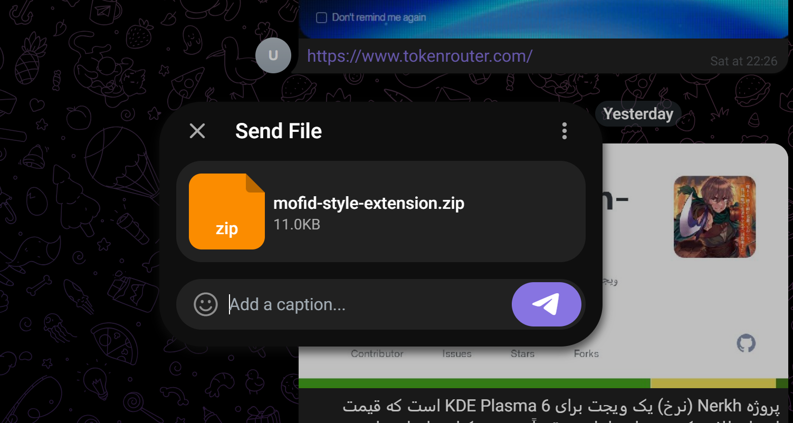

# لریو؛ اکوسیستم فارسی هویت، محتوا، گفتگو و ابزارهای روزمره

لریو فقط یک چت‌روم نیست؛ مجموعه‌ای از سرویس‌های هماهنگ است که با حساب مشترک،
رابط فارسی و تجربهٔ راست‌به‌چپ در وب کار می‌کنند.

> این مخزن نمای عمومی محصول، تصاویر واقعی، معماری و مسیر امنیت لریو است. اسرار
> عملیاتی، دادهٔ کاربران و کد خصوصی زیرساخت در این مخزن منتشر نمی‌شوند.

## سرویس‌ها

| سرویس | کاربرد |
|---|---|
| Lerio Auth | ورود یکپارچه، نشست و هویت مشترک |
| Lerio Blog | انتشار محتوا، پروفایل و تعامل اجتماعی |
| Lerio Chat | گفتگوی مستقیم، گروه، کانال و پیام‌های ذخیره‌شده |
| Lerio Eco | ابزارها و تجربه‌های مکمل |
| Lerio Time | ابزارهای زمان و برنامه‌ریزی |

## قابلیت‌های Chat

- گفتگوی خصوصی، گروه، کانال و پیام‌های ذخیره‌شده
- پاسخ، ویرایش، واکنش، سنجاق و گزارش پیام
- عکس، فایل، پیام صوتی، نظرسنجی، چک‌لیست و تاریخ
- دسترسی وابسته به عضویت و نقش همان گفتگو
- رابط فارسی RTL، تم روشن/تیره و هویت بصری یوزپلنگ ایرانی

## تصاویر واقعی نسخهٔ در حال توسعه

این تصاویر mockup یا تصویر تولیدشده با هوش مصنوعی نیستند.

### پیام‌بار

### انتخاب‌گر ایموجی

### منوی پیوست

### ارسال فایل

## معماری

مرورگر با سرویس‌های مستقل Auth، Blog، Chat، Eco و Time کار می‌کند. هویت بین
سرویس‌ها با SSO امضاشده منتقل می‌شود و مجوزهای Chat در API همان گفتگو بررسی
می‌شوند. جزئیات در [معماری عمومی](docs/ARCHITECTURE.md) آمده است.

## امنیت؛ وضعیت قابل اثبات

### کنترل‌های فعال

- HTTPS و Permissions Policy
- SSO امضاشده و نشست سمت سرور
- Same-Origin برای عملیات تغییردهنده
- کنترل عضویت و نقش در API هر گفتگو
- Query پارامتری و جلوگیری از انتشار credential در مخزن عمومی

### وضعیت E2EE

production فعلی هنوز متن و فایل را End-to-End رمز نمی‌کند؛ پس ادعای «E2EE فعال»
نداریم. [پروتکل هدف](docs/E2EE_PROTOCOL.md) مسیر واقعی را تعریف می‌کند: کلید هویت
هر دستگاه، epoch گفتگو، رمزنگاری پیام و فایل در مرورگر، تأیید QR، revoke دستگاه،
test vector عمومی و ممیزی مستقل.

فعال‌شدن E2EE باید با سه مدرک همراه باشد:

1. همان Crypto Client عمومی در production سرو شود؛
2. test vector عمومی و مستقل پاس شود؛
3. capture API نشان دهد سرور فقط envelope رمز‌شده دریافت می‌کند.

Crypto Client آزمایشی پیام و فایل در `src/e2ee/crypto.js` و test vector قابل اجرا در
`tests/e2ee-vectors.mjs` قرار دارد. اجرای `npm run test:e2ee` باید `PASS` بدهد؛ وجود
این تست به‌تنهایی به معنی فعال‌بودن E2EE در production نیست.

مدل تهدید در [THREAT_MODEL.md](docs/THREAT_MODEL.md) و گزارش مسئولانه در
[SECURITY.md](SECURITY.md) توضیح داده شده است.

## مجوز

کد و مستندات عمومی تحت MIT هستند. نام و نشان لریو با این مجوز واگذار نمی‌شوند.

